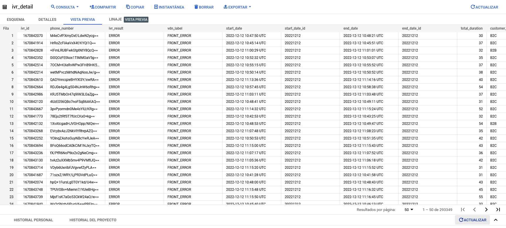
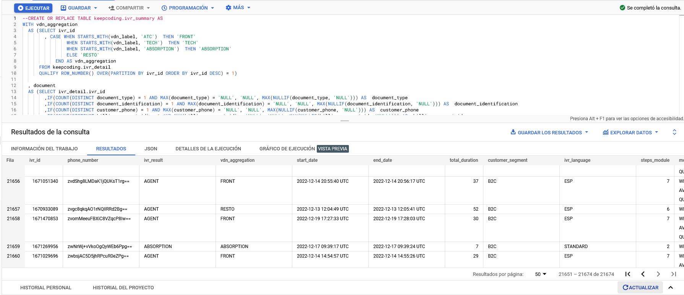
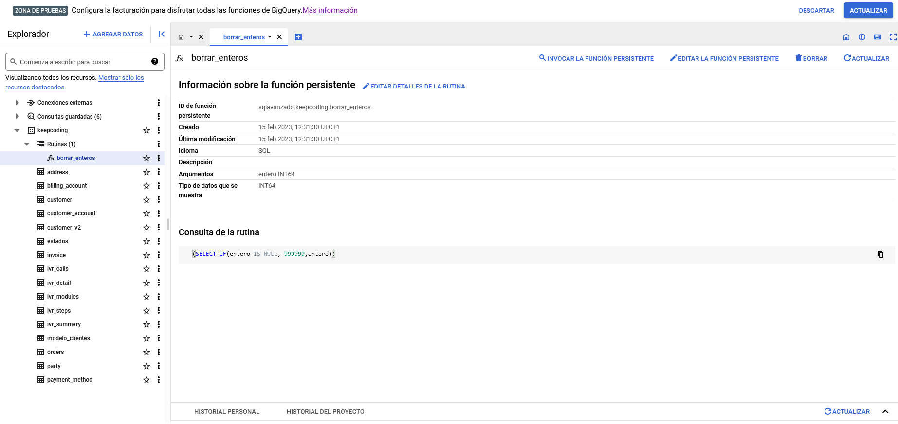

# Advanced-SQL-DW
## Práctica realizada con BigQuery

---

**Práctica de SQL-DW avanzado del Bootcamp Big Data & Machine Learning de KeepCoding utilizando la herramienta BigQuery**

---

El directorio  contiene  un archivo en pdf y dos carpetas:
* En el archivo Práctica Advanced SQL.pdf   Contiene el enunciado de la práctica.
* En la carpeta CSV contiene los tres CSV necesarios para realizar la práctica. (irv_calls.csv, irv_modules.csv, irv_steps.csv)
* En la carpeta llamada practica contiene tres archivos SQL con la solución a la práctica. (primer_ejercicio.sql, segundo_ejercicio.sql, tercer_ejercicio.sql)

## Enunciados ##

PRÁCTICA ADVANCED SQL 
1.  CREAR TABLA DE ivr_detail. 
Vamos a realizar el modelo de datos correspondiente a una  IVR de atención al 
cliente. 
Desde  los  ficheros  ivr_calls,  ivr_modules,  e  ivr_steps  crear  las  tablas  con  los 
mismos nombres dentro del dataset keepcoding. 
En ivr_calls encontramos los datos referentes a las llamadas. 
En ivr_modules encontramos los datos correspondientes a los diferentes 
módulos  por  los  que  pasa  la  llamada.  Se  relaciona  con  la  tabla  de  ivr_calls  a 
través del campo ivr_id. 
En  ivr_steps  encontramos  los  datos  correspondientes  a  los  pasos  que  da  el 
usuario dentro de un módulo. Se relaciona con la tabla de módulos a través de 
los campos ivr_id y module_sequence. 
Queremos tener los siguientes campos: 
calls_ivr_id 
calls_phone_number 
calls_ivr_result 
calls_vdn_label 
calls_start_date 
calls_start_date_id 
calls_end_date 
calls_end_date_id 
calls_total_duration 
calls_customer_segment 
calls_ivr_language 
calls_steps_module 
calls_module_aggregation 
module_sequece 
module_name 
module_duration 
module_result 
step_sequence 
step_name 
step_result 
step_description_error 
document_type 
document_identification 
 
 
customer_phone 
billing_account_id 
Los  campos calls_start_date_id y calls_end_date_id  son  campos de  fecha 
calculados,  del  tipo  yyyymmdd.  Por  ejemplo,  el  1  de  enero  de  2023  sería 
20230101. 
 
Entregar  el  código  SQL  que  generaría  la  tabla  ivr_detail  dentro  del  dataset 
keepcoding. 

 
2.  CREAR TABLA DE ivr_summary 
Con la base de la tabla ivr_detail vamos a crear la tabla ivr_sumary. Ésta será 
un resumen de la llamada donde se incluyen los indicadores más importantes de 
la llamada. Por tanto, sólo tendrá un registro por llamada. 
Queremos que tengan los siguientes campos: 
 
ivr_id: identificador de la llamada (viene de detail). 
phone_number: número llamante (viene de detail). 
ivr_result: resultado de la llamada (viene de detail). 
vdn_aggregation: es una generalización del campo vdn_label. Si vdn_label 
empieza por ATC pondremos FRONT, si empieza por TECH pondremos TECH si es 
ABSORTION  dejaremos  ABSORTION  y  si  no  es  ninguna  de  las  anteriores 
pondremos RESTO. 
start_date: fecha inicio de la llamada (viene de detail). 
end_date: fecha fin de la llamada (viene de detail). 
total_duration: duración de la llamada (viene de detail). 
customer_segment: segmento del cliente (viene de detail). 
ivr_language: idioma de la IVR (viene de detail). 
steps_module: número de módulos por los que pasa la llamada (viene de 
detail). 
module_aggregation: lista de módulos por los que pasa la llamada (viene 
de detail. 
document_type: en ocasiones es posible identificar al cliente en alguno 
de los pasos de detail usar el campo con el mismo nombre en detail. 
document_identification: en ocasiones es posible identificar al cliente 
en alguno de los pasos de detail usar el campo con el mismo nombre en 
detail. 
customer_phone: en ocasiones es posible identificar al cliente en alguno 
de los pasos de detail usar el campo con el mismo nombre en detail. 
 
 
billing_account_id:  en  ocasiones  es  posible  identificar  al  cliente  en 
alguno de los pasos de detail usar el campo con el mismo nombre en detail. 
masiva_lg: si una llamada pasa por el módulo con nombre AVERIA_MASIVA se 
indicará con un 1 en este flag, de lo contrario llevará un 0. 
info_by_phone_lg: si una llamada pasa por el step de nombre 
CUSTOMERINFOBYPHONE.TX y su step_description_error es NULL, quiere decir 
que hemos podido identificar al cliente a través de su número de teléfono. 
En ese caso pondremos un 1 ente flag, de lo contrario llevará un 0. 
info_by_dni_lg: si una llamada pasa por el step de nombre 
CUSTOMERINFOBYDNI.TX y su step_description_error es NULL, quiere decir 
que hemos podido identificar al cliente a través de su número de DNI. En 
ese caso pondremos un 1 ente flag, de lo contrario llevará un 0. 
repeated_phone_24H: es un flag (0 o 1) que indica si ese mismo número ha 
realizado una llamada en las 24h anteriores. 
cause_recall_phone_24H: es un flag (0 o 1) que indica si ese mismo número 
ha realizado una llamada en las 24h posteriores. 
 
Entregar el código SQL que generaría la tabla ivr_summary dentro del dataset 
keepcoding. 

  
 
3.  CREAR FUNCIÓN DE LIMPIEZA DE ENTEROS 
Crear una función de limpieza de enteros por la que si entra un null la función 
devuelva el valor -999999. 
 
Entregar el código SQL que generaría la función clean_integer dentro del dataset 
keepcoding. 

Marcos Salafranca Arnau                    Febrero de 2023