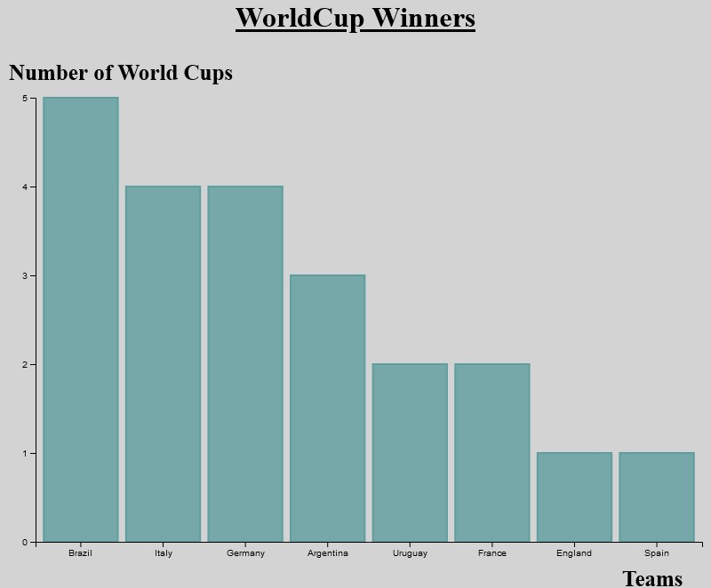
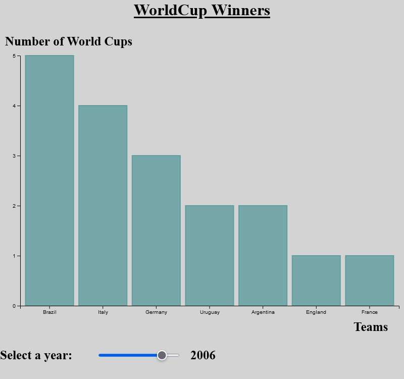
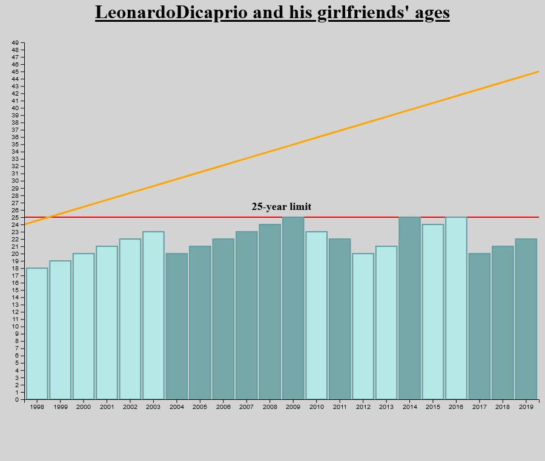

# D3js modern web visualisation 
## Práctica realizada con D3js##

---

**Práctica de Visualización web de Datos del Bootcamp Big Data & Machine Learning de KeepCoding utilizando la herramienta D3js**

---

El directorio  contiene tres carpetas:
* Final_1   Contiene el primer ejercicio de la practica.
* Final_1_slider   Contiene el slider funcional  con el primer ejercicio de la practica.
* Final_2   Contine el segundo ejercicio de la practica.

## Enunciados ##

1. Crear una gráfica de barras que represente cuántos mundiales tiene cada equipo.
2. Concectar el slider para que cada gráfica se modifique para ver quién tiene más mundiales hasta ese año.
3. Combinar 2 gráficas, representar la edad de Leonardo Di Caprio en una grafica de línea y representar la edad de sus ex en una gráfica de barras, usando la misma escala, para poder comparar ambos valores. 

Marcos Salafranca Arnau                    Enero de 2023