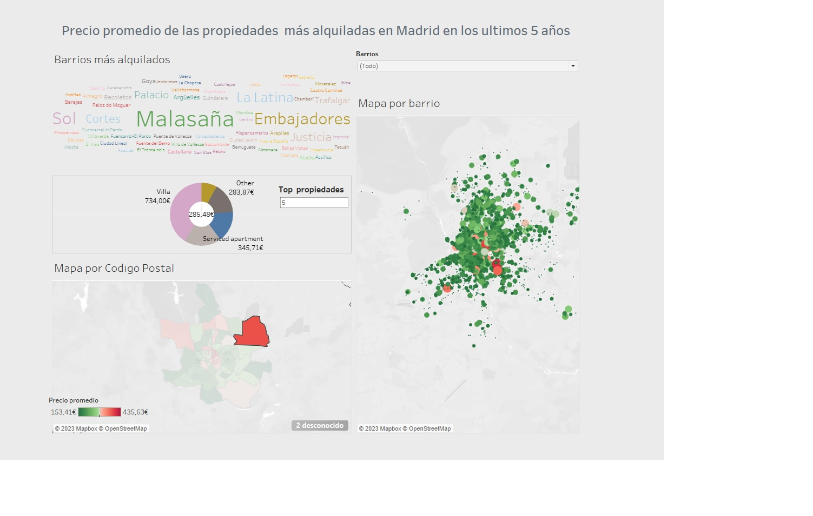
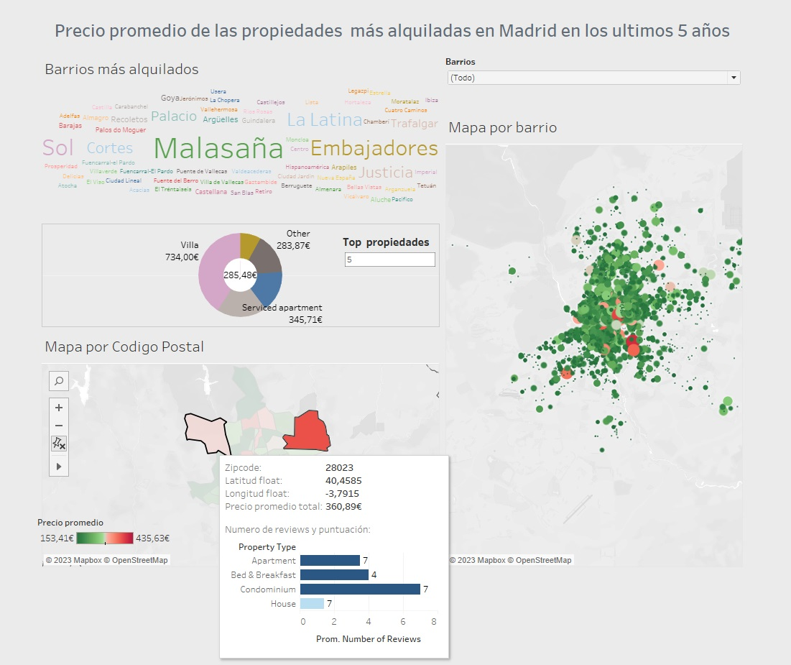
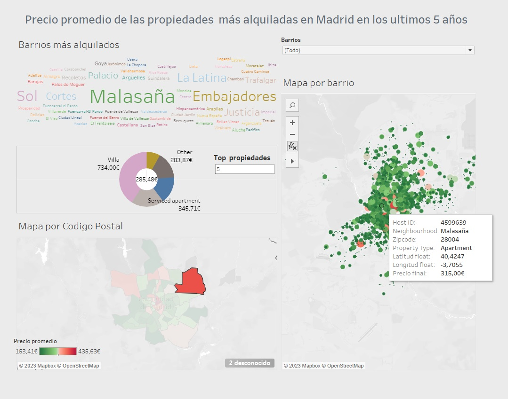

# Exploración y Visualización de Datos
## Práctica realizada con Tableau##

---

**Práctica de Exploración y Visualización de Datos del Bootcamp Big Data & Machine Learning de KeepCoding utilizando la herramienta Tableau**

---

Se ha realizado un dashboard con Tableau para poder saber el dinero que necesita un cliente de airbnb para realizar una reserva de una vivienda en la ciudad de Madrid, en los últimos 5 años. Se ha creado un campo calculado, donde se calcula la suma del precio de la vivienda y el precio del depósito para poder efectuar la reserva.

Para poder realizar el proyecto se han utilizado los datasets proporcionados durante el módulo:

+ *airbnb-listing Madrid.csv*  Archivo que se encuentra en la carpeta Data. Dataset
+ *Nveces_alquilado.csv*  Archivo que se encuentra en la carpeta Data. Dataset
+ *Data_Visualization.pdf*  Archivo que se encuentra en la carpeta Practica. Enunciado de la practica.
+ *Proyecto airbnb.twdx*  Archivo que se encuentra en la carpeta archivo. Archivo de Tableau donde se encuentra la practica realizada.

Antes de realizar el dashboard he intentado limpiar un poco el dataset.  Al igual que en el módulo he filtrado la columna City para conseguir solo datos de Madrid, también he desactivado las columnas que contenián URL y luego he excluido los datos NULL de Host Since, Neighborhood y Zipcode.

En el dashboard podemos ver distintos gráficos:

+ Una nube de palabras donde se puede apreciar a simple vista qué barrios son los más alquilados.
+ Un anillo donde nos muestra un top N de las propiedades y el precio promedio para la reserva.
+ Por ultimo dos mapas.
     + En el primer mapa, se muestra el precio promedio del alquiler en color verde-rojo (de más barato a más caro) según el código postal. Además se nos muestra una ventana emergente con el promedio de reviews y la puntuación recibida en color.
     + En el segundo, un mapa de barrios, donde se puede filtrar según  los barrios de interés. Donde nos aparece el precio promedio en color verde-rojo, el código ID de la vivienda, código postal y tipo de vivienda.

Marcos Salafranca Arnau                    Noviembre de 2022