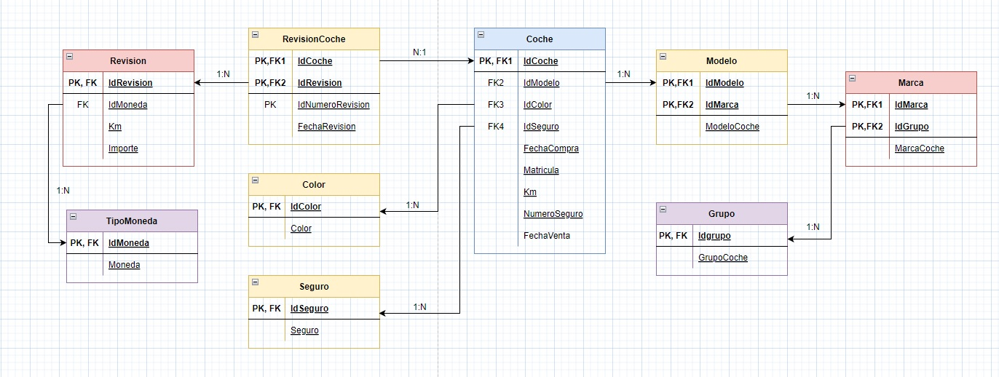
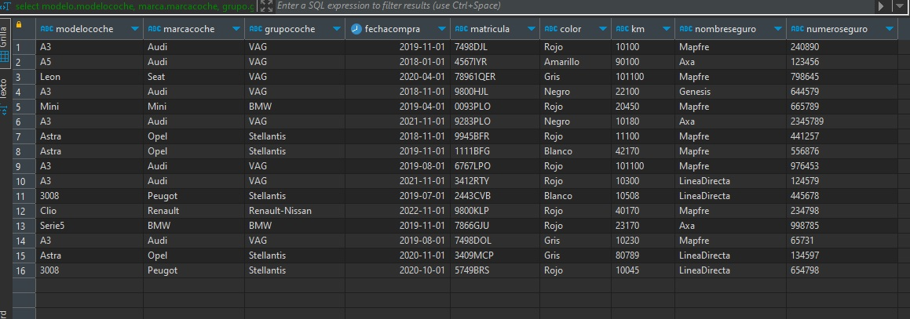

# Modelado de datos e introducción a SQL 
## Práctica realizada con Draw y DBeaver

---

**Práctica de modelado de datos e introducción a SQL del Bootcamp Big Data & Machine Learning de KeepCoding**

---

El directorio  diversos archivos:
* Práctica Modelado y SQL.docx.pdf   Contiene el enunciado de  la practica en formato PDF.
* Diagrama.drwio   Contiene el modelo Entidad Relación normalizado de la practica.
* ScriptPractica.sql   Contine el script SQL preparado para ejecutarse con tablas, PKs, relaciones y datos de la practica.
* ConsultaPractica.sql  Contine el script con la consulta SQL descrita en  la practica.

## Enunciado ##

En KeepCoding queremos gestionar la flota de vehículos de la empresa, controlando los
modelos de los coches, las marcas y el grupo empresarial de la marca (por ejemplo VW 
SEAT, Audi etc. pertenecen al grupo VAN.
De los coches también necesitamos saber el color del coche, su matrícula, el número total
de kilómetros que tiene, la compañía aseguradora ( Mapfre, MMT, AXA etc), el número de
póliza, fecha de compra etc.
Además queremos controlar de cada coche Las revisiones que se han pasado al coche
sabiendo los Kms que tenía en el momento de la revisión, la fecha de la revisión y el
importe de la revisión.
Habrá que generar una consulta SQL para sacar el siguiente listado de coches activos que
hay en keepcoding:
- Nombre modelo, marca y grupo de coches (los nombre de todos)
- Fecha de compra
- Matricula
- Nombre del color del coche
- Total kilómetros
- Nombre empresa que está asegurado el coche
- Número de póliza
Nota: Los importes se debe controlar la moneda (EURO, DÓLAR etc.).

Marcos Salafranca Arnau                    Enero de 2023